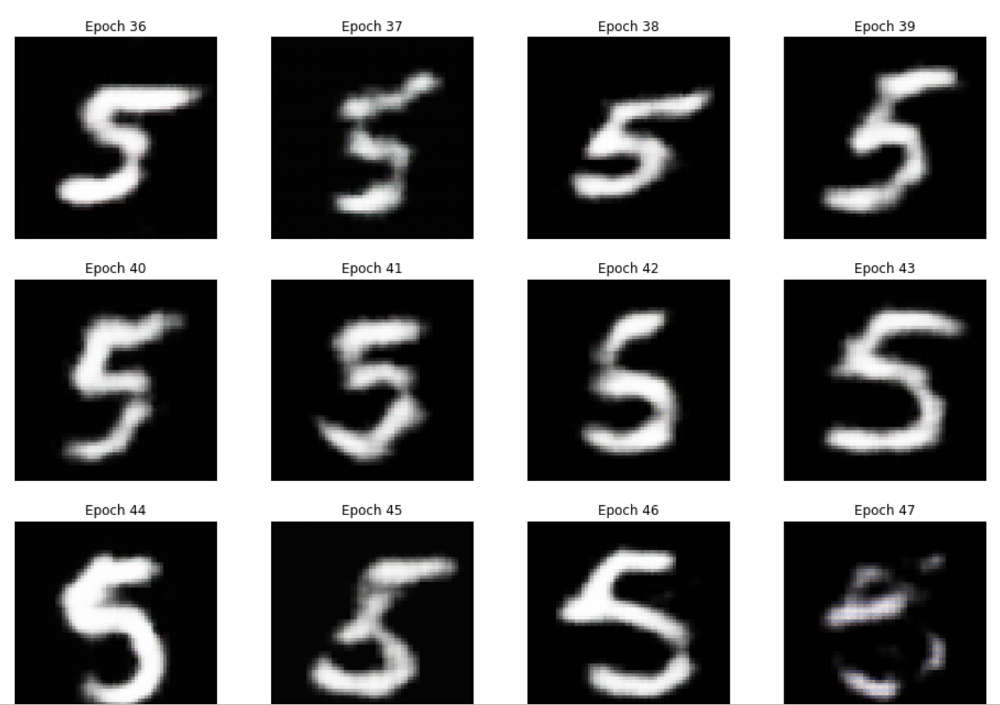
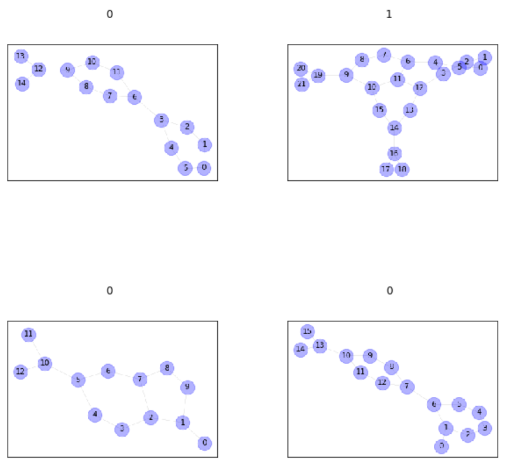
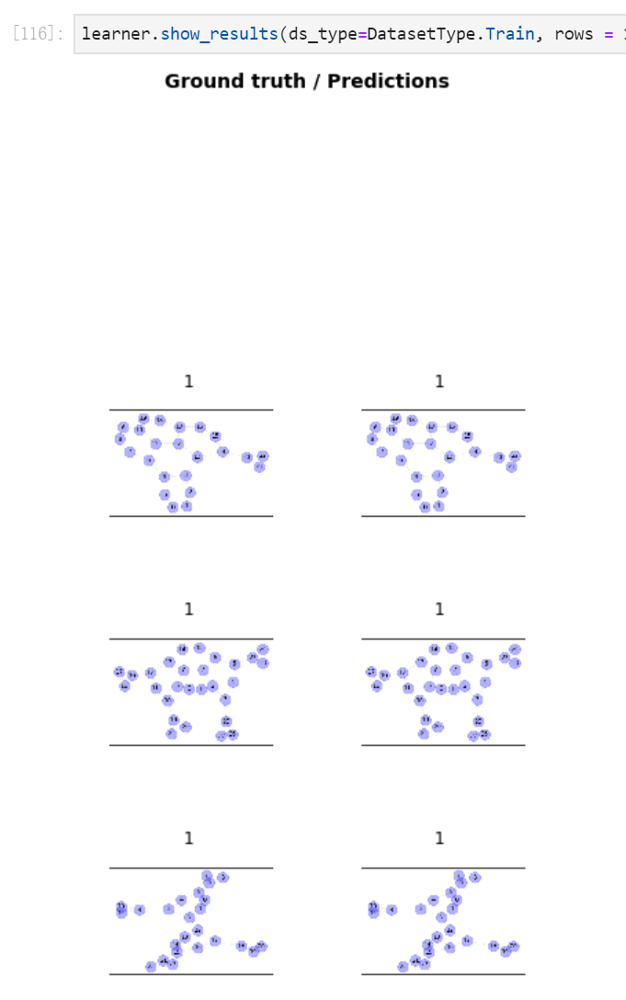

# 学习fastai而进行的项目学习
+ [数字图像识别](https://www.lintcode.com/ai/digit-recognition/data)

---

+ 手写数字生成任务  
**原始数据**
  

**自带wgan生成的数据**
  

**预训练对抗生成结果**
  

表现很差的原因在于，我们预训练的生成器，使用的是上一步wgan作为图片。  
现在改进一下，直接对生成器做一个预训练，然后模型效果如下图所示：

  

可以看到生成的效果已经非常不错了 此项目到底结束

---

+ 结合pyg用于分类任务  
目的：将fastai与pyg相结合

数据长这个样子

数据预测长这个样子

